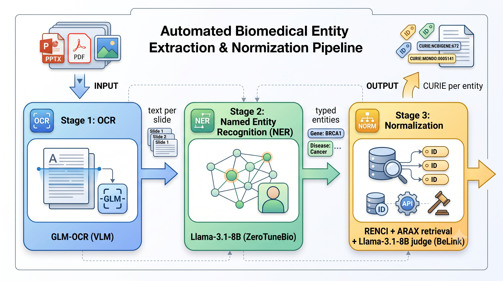

# BiomedCAT

BiomedCAT converts biomedical presentation slides into knowledge-base-grounded entities: it reads the text off each slide, extracts the typed biomedical entities, and links each one to a standard identifier (CURIE) in a biomedical knowledge base.

Knowledge-graph construction methods assume clean plain text such as PubMed abstracts, but biomedical researchers communicate through slides that mix text, figures, tables, and charts, where a single corrupted character can invalidate a gene symbol and break downstream extraction. BiomedCAT treats input modality as a first-class problem. The working domain is facioscapulohumeral muscular dystrophy (FSHD).



The pipeline runs in three stages, each an independent module with a single entry point that manages its own model lifecycle:

1. **OCR** — slide images to text (GLM-OCR).
2. **NER** — text to typed biomedical entities (Llama-3.1-8B, zero-shot).
3. **Normalization** — entities to knowledge-base identifiers (retrieval plus a language-model judge).

## Requirements

**Hardware.** A CUDA-capable **NVIDIA GPU with at least 8 GB of VRAM**. The language models run in 4-bit CUDA quantization, so an NVIDIA GPU is required. The pipeline therefore runs on **Linux or Windows** machines that have such a GPU. **macOS is not supported**, because it does not provide NVIDIA CUDA.

**Software.**
- Python 3.12 or newer
- [uv](https://docs.astral.sh/uv/) (the dependency manager; cross-platform)
- poppler and LibreOffice (system tools used to rasterize PDFs and convert slide decks)
- A Hugging Face account with approved access to `meta-llama/Llama-3.1-8B-Instruct`

## Installation

The Python environment is managed with `uv`, so the core steps are identical on every platform. Only the `uv` installer and the two system tools differ per OS.

**1. Install uv.**

| Platform | Command |
|---|---|
| Linux / macOS | `curl -LsSf https://astral.sh/uv/install.sh \| sh` |
| Windows (PowerShell) | `powershell -ExecutionPolicy ByPass -c "irm https://astral.sh/uv/install.ps1 \| iex"` |
| Any (via pip) | `pip install uv` |

**2. Install the system tools (poppler + LibreOffice).**

| Platform | Command |
|---|---|
| Linux (Debian / Ubuntu) | `sudo apt install poppler-utils libreoffice` |
| Windows | Install LibreOffice from [libreoffice.org](https://www.libreoffice.org/); install poppler (for example `conda install -c conda-forge poppler`, or download the prebuilt binaries) and add it to `PATH`. |

**3. Clone the repository and build the environment.**

```
git clone https://github.com/AI4Health-DAISY-LIG/BiomedCAT.git
cd BiomedCAT
uv sync
```

`uv sync` reproduces the exact dependency versions from `pyproject.toml` and `uv.lock`. The lockfile pins the CUDA 11.8 build of PyTorch; if your GPU needs a different CUDA version, adjust the `pytorch` index in `pyproject.toml` before running it.

**4. Add your Hugging Face token.**

Request access to `meta-llama/Llama-3.1-8B-Instruct` on Hugging Face (accept its license), create a token at [huggingface.co/settings/tokens](https://huggingface.co/settings/tokens), and place it in a `.env` file in the project root:

```
BIOMEDCAT_HF_TOKEN=hf_your_token_here
```

## Usage

Run the pipeline on a slide deck, PDF, or image (the command is the same on every platform):

```
uv run python -m biomedcat.pipeline path/to/your/slides.pptx
```

Supported input formats: `.pptx`, `.pdf`, `.png`, `.jpg`, `.jpeg`.

The run loads three models in sequence (GLM-OCR, then Llama for NER, then Llama for normalization) and queries two public resolvers, so it takes several minutes; the NER stage dominates. Progress is logged per stage. The result prints to the terminal and nothing is written to disk: the transcribed text per slide, the typed entities, and the identifier each entity was linked to (or NIL when the model abstains).

### Example output

```
--- OCR (2 slide(s)) ---
[slide 1]
Facioscapulohumeral muscular dystrophy (FSHD)
- FSHD is the third most common type of muscular dystrophy...

--- NER (31 entit(y/ies)) ---
  DISEASE                  FSHD
  GENE                     DUX4 protein
  EPIGENETIC_MODIFICATION  methylation
  ...

--- Normalization (28/31 linked) ---
  DISEASE   FSHD           -> MONDO:0008030
  GENE      DUX4 protein   -> NCBIGene:100288687
  ...
```

## How it works

Three design choices, all shaped by the 8 GB VRAM budget, are shared across the stages:

- **4-bit quantization** shrinks Llama-3.1-8B to roughly 5.7 GB so it fits the card.
- **Scale-to-zero lifecycle**: each stage loads its model, processes the input, and frees it, so the three models share one small GPU.
- **Determinism**: greedy decoding plus rule-based text steps (segmentation, grounding, deduplication) make runs reproducible; non-determinism is confined to the model calls.

**OCR.** GLM-OCR, a vision-language model, transcribes each slide. Decks and PDFs are rendered to page images, which preserves the layout that plain-text extraction would lose. Pages are transcribed in batches and streamed one batch at a time, so large files stay within memory.

**NER.** Following ZeroTuneBio, each sentence passes through three steps over Llama-3.1-8B: extract all professional terms to maximize recall, keep only the terms grounded in the sentence to drop hallucinations, and classify each grounded term into one of seven types or none to recover precision. The seven types are gene, disease, chemical, cell type, anatomy, chromosomal locus, and epigenetic modification.

**Normalization.** For each entity, candidates are retrieved concurrently from two resolvers (the RENCI name resolver and the ARAX entity normalizer), supplemented by a type-constrained pass that recovers correctly typed candidates surface matching misses. The pooled candidates are ranked, then a language-model judge selects the one whose type and meaning both match the entity, or abstains.


## Limitations and future work

- **Gold annotation.** No gold set exists yet for NER or Normalization, so those heuristics are unvalidated. This is the highest-priority item.
- **Hardware.** The pipeline requires a CUDA-capable NVIDIA GPU with 8 GB of VRAM and does not run on CPU or macOS. On the 8 GB target the language-model stages are at their computational floor.
- **Retrieval inputs.** Normalization depends on two public resolvers, so retrieval recall can drift as those services change.
- **Modality coverage.** OCR handles slide decks, PDFs, and images; slide-deck support depends on a system LibreOffice installation.

## Repository layout

The core is an installable Python package, `biomedcat`, organized one module per concern:

- `config.py`: deployment configuration (model identifiers, resolver endpoints, the Hugging Face token), read from the environment or a local `.env` file.
- `types.py`: the typed data model passed between stages (Slide, Entity, Candidate, NormalizedEntity) and the entity-type vocabulary.
- `runtime.py`: the shared runtime layer (CUDA and determinism setup, the 4-bit language-model factory, the greedy generation helper).
- `prompts.py`: every model-facing prompt, isolated so the research-tuned wording is versioned separately from the pipeline logic.
- `stages/ocr.py`, `stages/ner.py`, `stages/norm.py`: the three stages, each with a single entry point.
- `retrieval.py`: the RENCI and ARAX resolvers behind a common interface.
- `pipeline.py`: the orchestrator that runs one file through the three stages.


